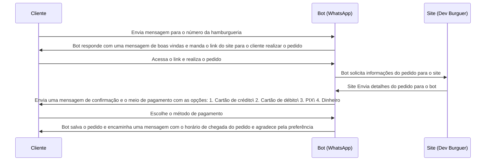
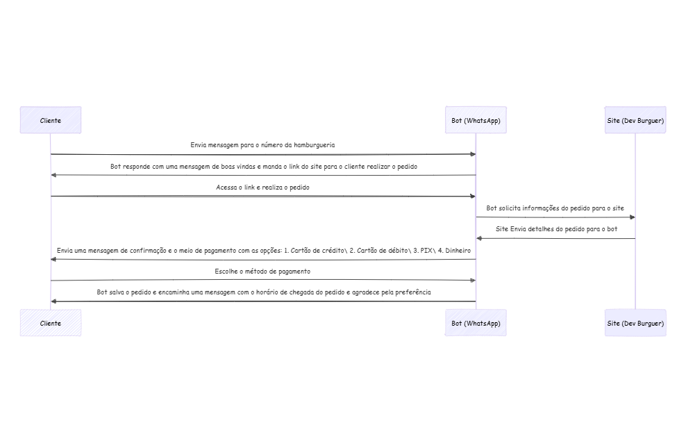

# Diagrama de Sequência: Pedido no Cardápio Digital Dev Burguer

```mermaid
sequenceDiagram

    participant Cliente
    participant Bot as Bot (WhatsApp)
    participant Site as Site (Dev Burguer)
    
    Cliente->>Bot: Envia mensagem para o número da hamburgueria
    Bot->>Cliente: Bot responde com uma mensagem de boas vindas e manda o link do site para o cliente realizar o pedido
    Cliente->>Bot: Acessa o link e realiza o pedido
    Bot->>Site: Bot solicita informações do pedido para o site
    Site->>Bot: Site Envia detalhes do pedido para o bot
    Bot->>Cliente: Envia uma mensagem de confirmação e o meio de pagamento com as opções: 1. Cartão de crédito\ 2. Cartão de débito\ 3. PIX\ 4. Dinheiro
    Cliente->>Bot: Escolhe o método de pagamento
    Bot->>Cliente: Bot salva o pedido e encaminha uma mensagem com o horário de chegada do pedido e agradece pela preferência
```
 

Diagrama de Sequência:

